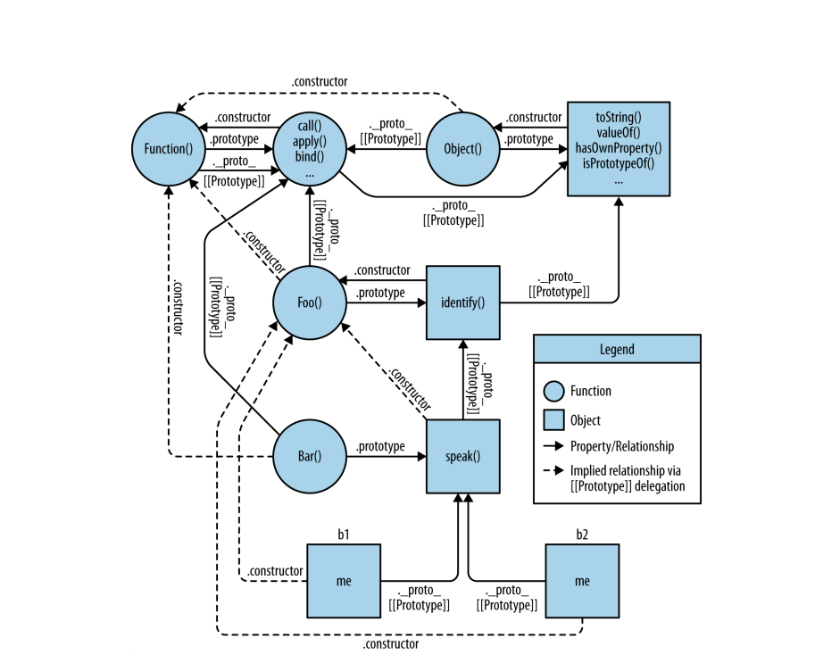
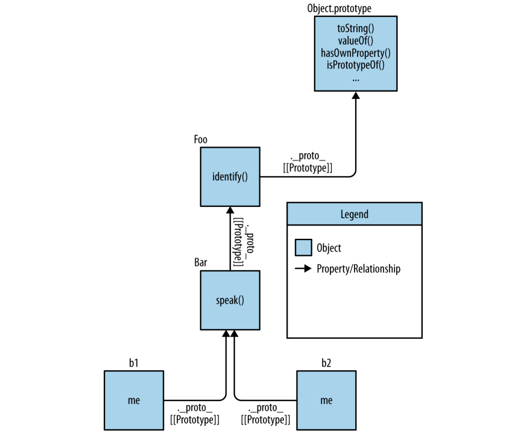

# Chapter 6   

## Behavior Delegation

> ### **Toward Delegation-Oriented Design**  
>  To properly focus our thoughts on how to use [[Prototype]] in the most straightforward way, we must recognize that it represents a fundamentally different design pattern from classes. We need to try to change our thinking from the **class/inheritance** design pattern to the **behavior delegation** design pattern

> **Delegation Theory**   
>Let’s say we have several similar tasks (“XYZ,” “ABC,” etc.) that we need to model in our software.
> * first define an object (not a class, nor a function as most JSers would lead you to believe) called Task, and it will have concrete be‐ havior on it that includes utility methods that various tasks can use Toward Delegation-Oriented Design | 115 (read: delegate to!)
>for each task (“XYZ,” “ABC”), you define an object to hold that task-specific data/behavior. You link your taskspecific object(s) to the Task utility object, allowing them to delegate to it when they need to.
>``` Javascript
>Task = {
>   setID: function(ID) { this.id = ID; },
>   outputID: function() { console.log( this.id ); }
>};
>
>// make `XYZ` delegate to `Task`
>XYZ = Object.create( Task );
>
>XYZ.prepareTask = function(ID,Label) {
>   this.setID( ID );
>   this.label = Label;
>};
>
>XYZ.outputTaskDetails = function() {
>   this.outputID();
>   console.log( this.label );
>};
>```
>In this code, Task and XYZ are not classes (or functions), they’re just objects. XYZ is set up via Object.create(..) to [[Prototype]]- delegate to the Task object
>As compared to class orientation (aka object orientation), I call this style of code ***OLOO (objects linked to other objects)***
> * Some other differences to note with OLOO-style code:   
>   1) Both the id and label data members are data properties directly on XYZ (neither is on Task). In general, with [[Prototype]] delegation, you want state to be on the delegators (XYZ, ABC), not on the delegate (Task).
>   2) With the class design pattern, we intentionally named output Task the same on both parent (Task) and child (XYZ), so that we could take advantage of overriding (polymorphism). In behavior delegation, we do the opposite: we avoid if at all possible naming things the same at different levels of the [[Prototype]] chain, because having those name collisions creates awkward/brittle syntax to disambiguate references, and we want to avoid that if we can
>   3) this.setID(ID); inside of a method on the XYZ object first looks on XYZ for setID(..), but since it doesn’t find a method of that name on XYZ, [[Prototype]] delegation means it can follow the link to Task to look for setID(..), which it of course finds . Moreover, because of implicit call-site this binding rules , when setID(..) runs, even though the method was found on Task, the this binding for that function call is XYZ, exactly as we’d expect and want. In other words, the general utility methods that exist on Task are available to us while interacting with XYZ, because XYZ can delegate to Task.
>***Behavior delegation*** means to let some object (XYZ) provide a delegation (to Task) for property or method references if they are not found on the object (XYZ).
>>Delegation is more properly used as an internal implementation detail rather than exposed directly in the API interface design. In the previous example, we don’t necessarily intend with our API design for developers to call XYZ.setID() (though we can, of course!). We sorta hide the delegation as an internal detail of our API, where XYZ.prepareTask(..) delegatesto Task.setID(..)


> **Mutual delegation (disallowed)**  
> 
> You cannot create a cycle where two or more objects are mutually delegated (bidirectionally) to each other. If you link B to A, and then try to link A to B, you will get an error.
>
> it’s disallowed because engine implementors have observed that it’s more performant to check for (and reject!) the infinite circular reference once at set-time rather than needing to have the performance hit of that guard check every time you look up a property on an object.


>  **Mental Models Compared**  
>``` Javascript
>Foo = {
>   init: function(who) {
>   this.me = who;
>   },
>   identify: function() {
>   return "I am " + this.me;
> }
>};
>
>Bar = Object.create( Foo );
>Bar.speak = function() {
>   alert( "Hello, " + this.identify() + "." );
>};
>
>var b1 = Object.create( Bar );
>b1.init( "b1" );
>var b2 = Object.create( Bar );
>b2.init( "b2" );
>
>b1.speak();
>b2.speak();
>```
> * The class-style code snippet implies this mental model of entities and their relationships:
>       * 
> * mental model for OLOO-style code:
>       * 
>

> **Widget “Classes”**   
> * Implement the “class” design in classic-style pure JS without any “class” helper library or syntax:
>>``` Javascript
>>function Widget(width,height) {
>>   this.width = width || 50;
>>   this.height = height || 50;
>>   this.$elem = null;
>>}
>>
>>Widget.prototype.render = function($where){
>>   if (this.$elem) {
>>   this.$elem.css( {
>>   width: this.width + "px",
>>   height: this.height + "px"
>>   } ).appendTo( $where );
>>   }
>>};
>>
>>// Child class
>>function Button(width,height,label) {
>>   // "super" constructor call
>>   Widget.call( this, width, height );
>>   this.label = label || "Default";
>>   this.$elem = $( "<button>" ).text( this.label );
>>}
>>
>>// make `Button` "inherit" from `Widget`
>>Button.prototype = Object.create( Widget.prototype );
>>
>>// override base "inherited" `render(..)`
>>Button.prototype.render = function($where) {
>>   // "super" call
>>   Widget.prototype.render.call( this, $where );
>>   this.$elem.click( this.onClick.bind( this ) );
>>};
>>
>>Button.prototype.onClick = function(evt) {
>>   console.log( "Button '" + this.label + "' clicked!" );
>>};
>>
>>$( document ).ready( function(){
>>   var $body = $( document.body );
>>   var btn1 = new Button( 125, 30, "Hello" );
>>   var btn2 = new Button( 150, 40, "World" );
>>   btn1.render( $body );
>>   btn2.render( $body );
>>} );
>>```
>>
> * ES6 class sugar
>>``` Javascript
>>class Widget {
>> constructor(width,height) {
>>  this.width = width || 50;
>>  this.height = height || 50;
>>  this.$elem = null;
>>  
>> render($where){
>>  if (this.$elem) {
>>      this.$elem.css( {
>>          width: this.width + "px",
>>          height: this.height + "px"
>>          } ).appendTo( $where );
>>      }
>>  }
>>}
>>
>>class Button extends Widget {
>>  constructor(width,height,label) {
>>      super( width, height );
>>      this.label = label || "Default";
>>      this.$elem = $( "<button>" ).text( this.label );
>>  }
>>  render($where) {
>>      super( $where );
>>      this.$elem.click( this.onClick.bind( this ) );
>>  }
>>  onClick(evt) {
>>      console.log( "Button '" + this.label + "' clicked!" );
>>  }
>>}
>>$( document ).ready( function(){
>>      var $body = $( document.body );
>>      var btn1 = new Button( 125, 30, "Hello" );
>>      var btn2 = new Button( 150, 40, "World" );
>>      btn1.render( $body );
>>      btn2.render( $body );
>>} );
>>```

> **Delegating Widget Objects**   
> * simpler Widget/Button example, using OLOO-style delegation:
>> ``` Javascript
>>var Widget = {
>>      init: function(width,height){
>>          this.width = width || 50;
>>          this.height = height || 50;
>>          this.$elem = null;
>>      },
>>          insert: function($where){
>>              if (this.$elem) {
>>                  this.$elem.css( {
>>                  width: this.width + "px",
>>                  height: this.height + "px"
>>              }).appendTo( $where );
>>          }
>>      }
>>};
>>var Button = Object.create( Widget );
>>Button.setup = function(width,height,label){
>>      // delegated call
>>      this.init( width, height );
>>      this.label = label || "Default";
>>      this.$elem = $( "<button>" ).text( this.label );
>>};
>>Button.build = function($where) {
>>      // delegated call
>>      this.insert( $where );
>>      this.$elem.click( this.onClick.bind( this ) );
>>};
>>Button.onClick = function(evt) {
>>      console.log( "Button '" + this.label + "' clicked!" );
>>};
>>$( document ).ready( function(){
>>      var $body = $( document.body );
>>      var btn1 = Object.create( Button );
>>      btn1.setup( 125, 30, "Hello" );
>>      var btn2 = Object.create( Button );
>>      btn2.setup( 150, 40, "World" );
>>      btn1.build( $body );
>>      btn2.build( $body );
>>} );
>>```
> * With this OLOO-style approach, we don’t think of Widget as a parent and Button as a child. Rather, Widget is just an object and is sort of a utility collection that any specific type of widget might want to delegate to, and Button is also just a standalone object (with a delegation link to Widget, of course!). 
> * From a design pattern perspective, we didn’t share the same method name render(..) in both objects, the way classes suggest, but instead we chose different names (insert(..) and build(..)) that were more descriptive of what task each does specifically. The initialization methods are called init(..) and setup(..), respectively, for the same reasons.

> **Links as Fallback**
> It may be tempting to think that the these links between objs *primarily* provide a sort of fallback for "missing" properties or methods. While that may be an observed outcome.
>``` Javascript
>var anotherObj = { 
>   cool: function() { console.log('cool') }
>}
>
>var myObj = Object.create( anotherObj );
>
>myObj.cool(); //cool
>```
>